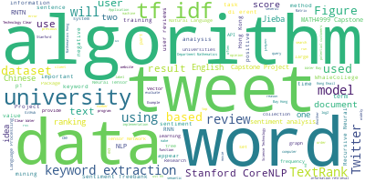
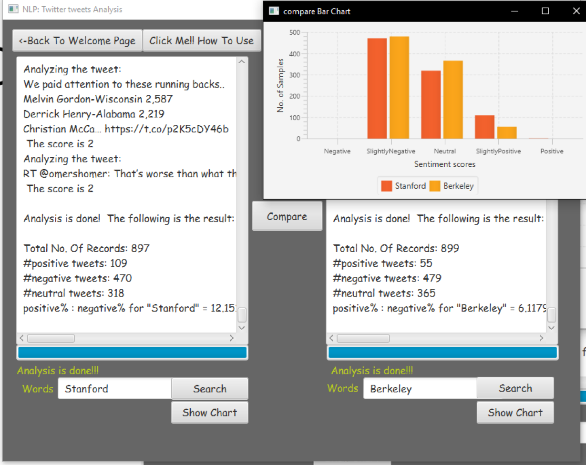

# MATH4999FYP
## Twitter Tweets Analysis

<ul>
<li>NLP + statistical approach</li>
<li>Graphical User Application</li>
<li>Written in Java SE8</li>
<li>external jars: twitter-api and Stanford CoreNLP tools</li>
</ul>

## Research Paper of this project
[Research on Natural Language Processing Algorithms on Review Data](./report.pdf)
## WordCloud for giving you an general idea of the Research Paper

## Screen shot of the app

## Download the app to have a trial (Both MacOS and Win10)
<a href="https://drive.google.com/drive/folders/1hwhCPKTMisP0KW9z-EfICnxSyR9huZDC?usp=sharing" target="_blank">App Download Link</a>
